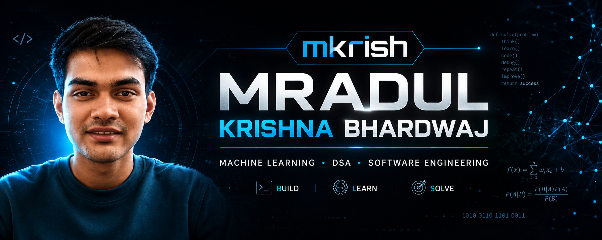

 

### `Machine Learning`  •  `DSA`  •  `Software Engineering`

 

---

## 🧑‍💻 `whoami`

I'm **Mradul Krishna Bhardwaj**, a B.Tech Computer Science student focused on **Machine Learning, Data Structures & Algorithms, and practical software engineering**.

I enjoy turning what I learn into things I can actually build — from solving algorithmic problems to developing machine learning applications and exploring how real-world software systems work.

> **"I don't understand this yet." → "I built something with it."**

Currently working toward becoming a strong **ML + Software Engineering candidate** by combining problem solving with hands-on development.

---

## 🚀 Featured Project

### 🎓 Student Placement Predictor

**An end-to-end Machine Learning application that predicts a student's placement outcome from relevant input features.**

Instead of stopping at model training, I took the project all the way from **data → preprocessing → model → application → deployment**.

#### 🔍 What I Built

* 🧹 Data preprocessing and preparation
* 📊 Exploratory data analysis
* 🤖 Machine Learning classification model
* 📈 Model evaluation
* 🖥️ Interactive Streamlit web application
* ☁️ Live cloud deployment
* 🔄 Real-time predictions from user input

#### 🛠️ Built With

`Python` `Pandas` `NumPy` `Scikit-learn` `Matplotlib` `Streamlit`

> **First deployed ML project — from learning the concepts to putting a working application online.**

---

## ⚡ Current Focus

<table>
<tr>

<td width="33%" align="center">

### 🤖 Machine Learning

Building strong ML fundamentals and turning concepts into practical, deployable projects.

</td>

<td width="33%" align="center">

### 🧠 DSA

**350+ problems solved** while strengthening algorithms, data structures, recursion, backtracking, and problem solving in Java.

</td>

<td width="33%" align="center">

### 🏗️ Software Engineering

Learning APIs, backend development, databases, deployment, and system design fundamentals.

</td>

</tr>
</table>

---

## 🏆 Highlights

<table>
<tr>

<td align="center" width="50%">

### 🧠 350+

**DSA Problems Solved**

Java • Algorithms • Problem Solving

</td>

<td align="center" width="50%">

### 🏆 Flipkart GRiD 8.0

**Semifinalist**

Algorithms • Problem Solving

</td>

</tr>
</table>

---

# 🧰 Tech Stack

### 💻 Languages

### 🤖 Machine Learning & Data

### ⚙️ Backend & Databases

### ☁️ Tools & Platforms

### 🎨 Creative Tools

---

# 🧠 Problem Solving

### `350+` DSA Problems Solved

**Java**  •  **Data Structures**  •  **Algorithms**

**Recursion**  •  **Backtracking**  •  **Problem Solving**

 

---

# 📊 GitHub Analytics

  

---

# 🕹️ `mkrish.exe // arcade`

<picture>
  <source
    media="(prefers-color-scheme: dark)"
    srcset="https://raw.githubusercontent.com/mradulkrish911/mradulkrish911/output/pacman-contribution-graph-dark.svg"
  />

<source
 media="(prefers-color-scheme: light)"
 srcset="https://raw.githubusercontent.com/mradulkrish911/mradulkrish911/output/pacman-contribution-graph.svg"
/>

 </picture>

 

Just a little arcade break between commits. 👾

---

# 🌐 Connect With Me

 

### `Learn → Build → Break → Debug → Repeat.`

Always learning. Always building. 🚀

